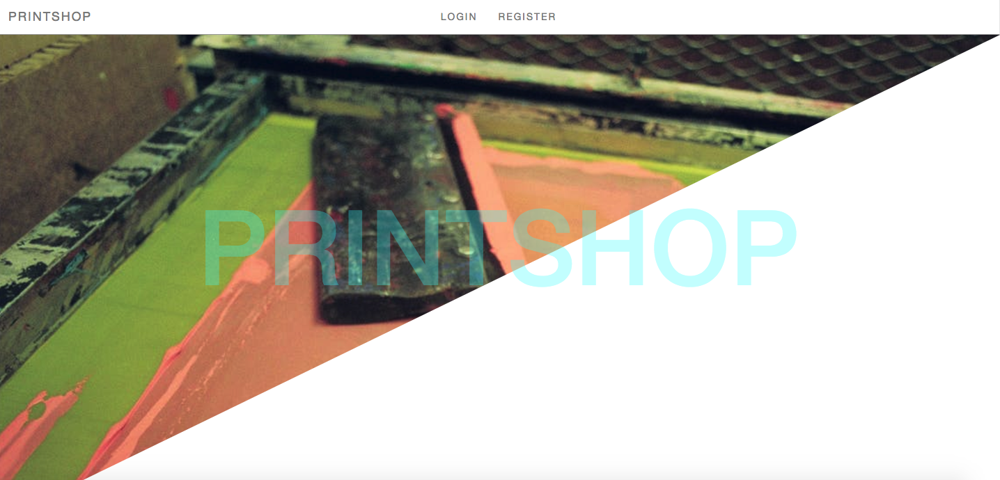

# PRINTSHOP
[Visit PRINTSHOP!](http://www.boiling-sands-25313.herokuapp.com)

### Aim of the project

For my final project I wanted to keep it quite simple and cement some concpets of Ruby that I felt like I struggled with initially. The PRINTSHOP is designed so artists can upload and sell their prints, and users can view and filter the prints on a main index page.

### Planning

When planning the project, I used balsamiq and Trello to work out the user journey and which routes needed to be included.

### Coding

The app was created using Ruby on Rails to create an external API and Angular on the front end.

### What went well

##### Coding

I am very happy with how the project turned out. I didn't manage to get eveything done that I had intended but I am very proud that I managed to create the API and build an aesthetic looking app.

### What was a challenge

#### Coding

As there were quite a few features that I wanted to include in the project, I ran out of time and didn't manage to include as much as I would have liked. 

### If we had more time we'd like to...

* Filter by price, catergory, prominent colors
* Add tags to each print
* Finish Stripe payment
* Include mailer when a payment is received
